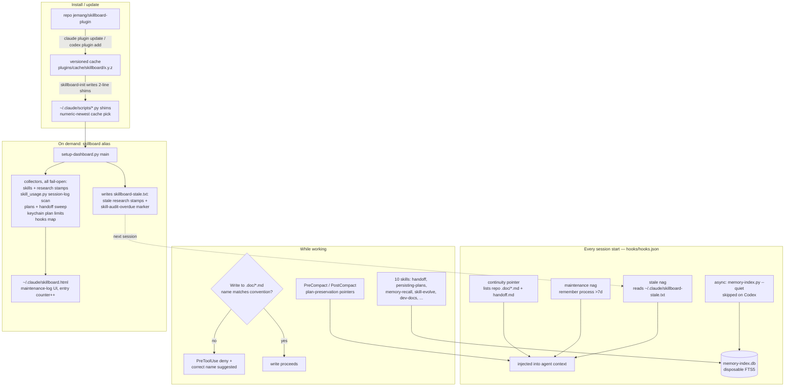

# Architecture — Skillboard

> Generated by feature-explainer/dev-docs on 2026-09-29. Sources: `hooks/hooks.json`, `scripts/setup-dashboard.py`, `scripts/memory-index.py`, `scripts/skill_usage.py`, `skills/*/SKILL.md`, `.claude-plugin/` + `.codex-plugin/` manifests, `tests/`.

## System diagram

## Services & responsibilities

| Component | Stack | Role | Owns |
|---|---|---|---|
| `hooks/hooks.json` | bash one-liners | session-start context injection, compaction plan preservation, `.doc/` naming guard, optional rtk/code-review-graph integration | all automatic behavior; every hook fails open |
| `scripts/setup-dashboard.py` | Python stdlib | on-demand dashboard generator (maintenance-log UI) | `skillboard.html`, `skillboard-stale.txt`, snapshot + `entry` counter |
| `scripts/memory-index.py` | Python stdlib + SQLite FTS5 | disposable index over all memory homes | `memory-index.db` (files stay the only truth) |
| `scripts/skill_usage.py` | Python stdlib | per-machine skill-usage counts from session logs | usage evidence for dashboard pills + skill-evolve baseline |
| `skills/` (10) | SKILL.md | continuity, memory recall, docs generation, coding discipline, audits | agent workflows on both harnesses |
| `.claude-plugin/` + `.codex-plugin/` | JSON manifests | version gate, marketplace metadata | `tests/test_manifests.py` forces equal versions |

## Data flow

1. **Release**: edit repo → bump BOTH manifests → push → `claude plugin update skillboard@skillboard` + `codex plugin add skillboard@skillboard --json` per machine → shims resolve newest cache numerically.
2. **Session start**: sync hooks inject continuity/nag context; async hook rebuilds the memory index (Claude only — Codex ≥0.157 still skips async, run `skillboard` manually).
3. **Audit loop**: dashboard generation stamps `skillboard-stale.txt` (90d research stamps, audit-overdue marker from `skillboard-audit-stamp` mtime) → next session nags → `/skill-evolve` runs usage-baseline-first audit → `touch ~/.claude/skillboard-audit-stamp` resets.

## Boundaries & contracts

- Files are the only memory truth; the SQLite index is disposable.
- One fact, one home (repo gotchas / auto-memory / handoff+`.doc` / brain).
- Every hook fails open — missing optional tool = silent no-op.
- Skill descriptions are weak-model routing infrastructure: rich triggers + NOT-for cross-pointers, never shortened.
- Codex has no skill auto-routing: every plugin skill needs a row in the `AGENTS.md` index or it is invisible there.
- Dashboard design system: `DESIGN.md` + `.impeccable/` (local-only, gitignored).

## External dependencies

- `api.anthropic.com/api/oauth/usage` — one HTTPS call for the plan-limits panel; keychain token in-process only; panel hides on any failure. Everything else is zero-network and offline-safe.
- Optional CLIs (rtk, codegraph, code-review-graph, gh, jq): degrade silently when absent.

## Manual Notes

<!-- preserved on regeneration -->
